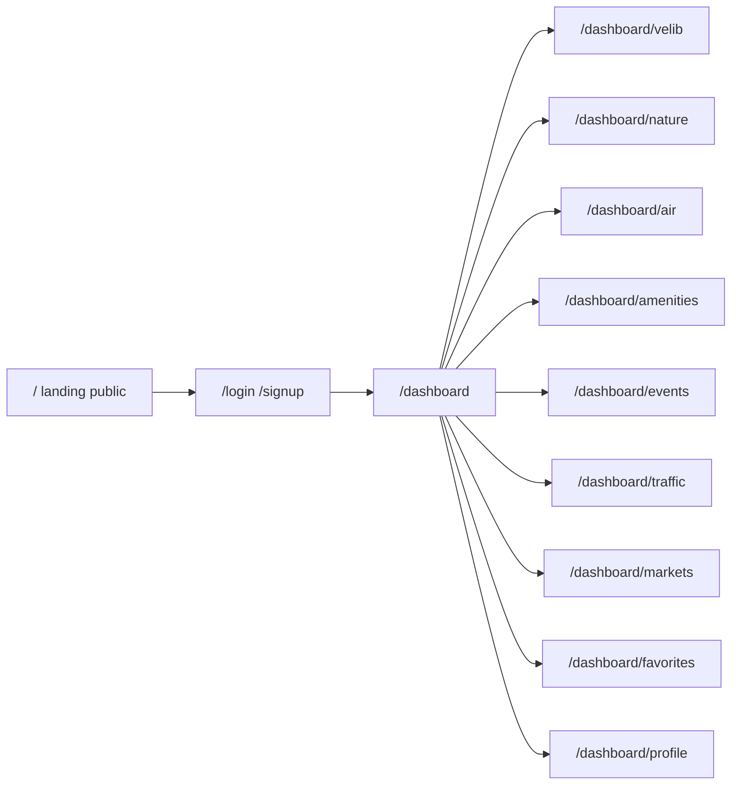

# Paris Open Data Dashboard

Yes: **one private page per theme** is the right split. Vélib’ is live and point-based, trees are huge and slow-changing, events are a calendar, air quality is charts. A single mega-page would mix incompatible UX.

The app stays French-first (the source data is French). UI copy in French, with source links back to [opendata.paris.fr](https://opendata.paris.fr).

## Git branch

All implementation happens on a **new branch**, not `main`:

- Branch name: `feat/paris-open-data-dashboard`
- Created from current `main`
- First commit on that branch: add `PLAN.md` (this plan, without Cursor frontmatter) so the branch actually contains the plan
- No push unless you ask

## Product shape

**Public landing (`/`)** — what the app is, who the data comes from, a few live headline stats (Vélib’ bikes available, tree count, today’s ATMO-style air snapshot, event count), and CTAs to sign up / log in. Logged-in users can still visit it (no bounce-away).

**Auth** — email + password signup and login, stored locally. No OAuth in v1.

**Private shell** — sidebar + top bar: overview, one link per theme, favorites, profile, logout.

Each theme page follows the same layout: KPI strip, map and/or chart, searchable table, favorite button on rows. Themes that wrap two datasets use **tabs on that page**, not extra routes:

- **Vélib’** — `velib-disponibilite-en-temps-reel` (live bikes / docks / e-bikes)
- **Nature** — tabs: `les-arbres`, `espaces_verts`
- **Air** — `qualite-de-l-air-indice-atmo` (charts, not a dense map)
- **Commodités** — tabs: `fontaines-a-boire`, `sanisettesparis`
- **Événements** — `que-faire-a-paris-` (upcoming list + map)
- **Voirie** — tabs: `chantiers-a-paris`, `dans-ma-rue` (current street issues; skip the heavy `accidentologie0` archive in v1)
- **Marchés** — `marches-decouverts` (days / hours / arrondissement)

**Also in v1:** favorites (per user, per record), profile (email + preferred arrondissement used as default filter), table search/filter, email verification (Mailpit locally, Resend in production). **Not in v1:** email/push alerts (needs a cron); favorites are the stepping stone.

## Stack (on top of the existing Next 16 + Tailwind 4 app)

- **Auth:** [Better Auth](https://www.better-auth.com/) (email/password) — Auth.js credentials would mean rolling hashing and sessions by hand
- **DB:** SQLite via Drizzle (`better-sqlite3`), file at `data/dashboard.sqlite` (gitignored)
- **Route protection:** Next.js 16 [`proxy.ts`](https://nextjs.org/docs/app/api-reference/file-conventions/proxy) (not `middleware.ts`) guarding `/dashboard/*`; still re-check session in server code
- **Maps:** Leaflet + OSM (no API key). Trees/chantiers fetched by **bounding box**, never all 200k trees at once
- **Charts:** Recharts
- **UI:** Tailwind 4 + small shared primitives (button, input, card, table). No extra design-system install unless it stays lightweight

Read Next.js 16 guides under `node_modules/next/dist/docs/` before implementing caching, `proxy.ts`, and server functions.

## Data layer

Single server client, never call Open Data Paris from the browser (CORS, rate limits, cache control):

`GET https://opendata.paris.fr/api/explore/v2.1/catalog/datasets/{id}/records`

Shared helper in [`lib/opendata/client.ts`](lib/opendata/client.ts): `limit`, `offset`, `where`, `refine`, `order_by`. Cache by dataset:

- Vélib’: ~60s
- Events / Dans Ma Rue / chantiers: ~1h
- Trees, parks, fountains, toilets, markets, ATMO: ~24h

Landing stats use the same client with `limit=0` / aggregates so the homepage stays cheap.

## Auth and persistence

Better Auth Drizzle tables for users/sessions, plus app tables:

- `favorite`: `userId`, `datasetId`, `recordId`, `label`, `geo` JSON
- `profile`: `userId`, `arrondissement` (nullable)

Signup/login pages at `/signup` and `/login`. Session cookie; `proxy.ts` redirects anonymous `/dashboard` traffic to `/login?next=…`.

## File layout (key pieces)

- [`app/page.tsx`](app/page.tsx) — replace the create-next-app landing
- [`app/login/page.tsx`](app/login/page.tsx), [`app/signup/page.tsx`](app/signup/page.tsx)
- [`app/dashboard/layout.tsx`](app/dashboard/layout.tsx) — private chrome
- [`app/dashboard/page.tsx`](app/dashboard/page.tsx) — cross-theme KPIs
- [`app/dashboard/[theme]/page.tsx`](app/dashboard/[theme]/page.tsx) or explicit routes per theme if types stay clearer that way
- [`proxy.ts`](proxy.ts)
- [`lib/auth.ts`](lib/auth.ts), [`lib/opendata/`](lib/opendata/), [`lib/db/`](lib/db/)
- [`components/map/ParisMap.tsx`](components/map/ParisMap.tsx), shared KPI/table/favorite controls

## Implementation order

1. Create `feat/paris-open-data-dashboard` and add `PLAN.md`
2. Landing + dashboard shell (empty pages, nav) so the IA is visible
3. SQLite + Better Auth + proxy protection
4. Open Data client + landing live stats
5. Theme pages one by one (Vélib’ first as the live showcase, then amenities/markets, then nature with bbox, then events/air/traffic)
6. Favorites + profile arrondissement filter wired into every list/map

## Out of scope for this pass

Email verification, OAuth, deploy hosting, alert emails, CSV export, English i18n, accidentology archive.
