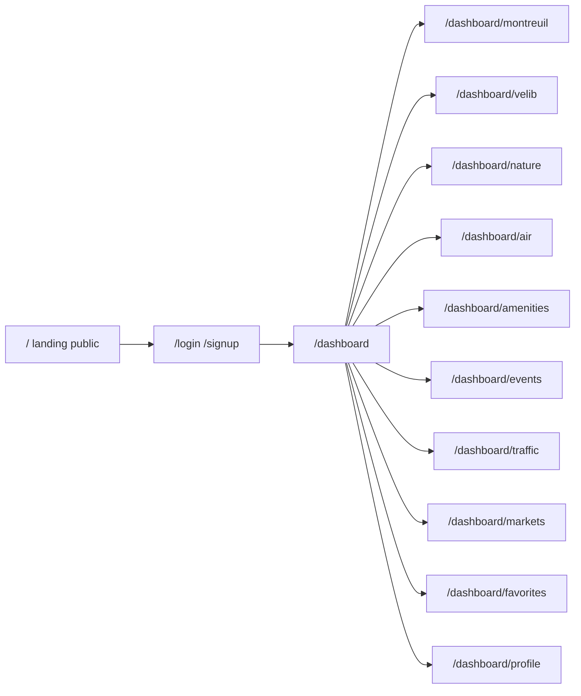

# Paris Open Data Dashboard

Yes: **one private page per theme** is the right split. Vélib’ is live and point-based, trees are huge and slow-changing, events are a calendar, air quality is charts. A single mega-page would mix incompatible UX.

The app is French-first (the source data is French). UI chrome is available in **French, English and Spanish**, with always-on URL prefixes (`/fr`, `/en`, `/es`; default `fr`). Open Data record values stay in the source language. Source links go back to [opendata.paris.fr](https://opendata.paris.fr) and [data.montreuil.fr](https://data.montreuil.fr).

Live: [dashboard.vvbb.fr](https://dashboard.vvbb.fr). Hosting: Railway (SQLite volume). Schema: Drizzle migrations in `lib/db/migrations`, applied on boot.

## Product shape

**Public landing (`/` → `/fr`)** — what the app is, who the data comes from, a few live headline stats (Vélib’ bikes available, tree count, today’s ATMO-style air snapshot, event count), and CTAs to sign up / log in. Logged-in users can still visit it (no bounce-away). The same page exists at `/en` and `/es`.

**Auth** — email + password, email verification (Mailpit locally, Resend in production), then an email OTP as a second step. No OAuth.

**Private shell** — sidebar + top bar: overview, Montreuil, one link per Paris theme, favorites, profile, logout.

Each theme page follows the same layout: KPI strip, map and/or chart, searchable table, favorite button on rows. Themes that wrap two datasets use **tabs on that page**, not extra routes:

- **Montreuil** — Vélib’ Montreuil, voirie trees, jardins, bornes-fontaines / brumisateurs, compteur rue Étienne Marcel
- **Vélib’** — `velib-disponibilite-en-temps-reel` (live bikes / docks / e-bikes)
- **Nature** — tabs: `les-arbres`, `espaces_verts`
- **Air** — `qualite-de-l-air-indice-atmo` (charts, not a dense map)
- **Commodités** — tabs: `fontaines-a-boire`, `sanisettesparis`
- **Événements** — `que-faire-a-paris-` (upcoming list + map)
- **Voirie** — tabs: `chantiers-a-paris`, `dans-ma-rue` (current street issues; skip the heavy `accidentologie0` archive)
- **Marchés** — `marches-decouverts` (days / hours / arrondissement)

**Also in v1:** favorites (per user, per record), profile (email + preferred arrondissement used as default filter), table search/filter, email verification. **Not in v1:** email/push alerts (needs a cron); favorites are the stepping stone.

## Stack

- **Auth:** [Better Auth](https://www.better-auth.com/) (email/password + verification + email OTP)
- **DB:** SQLite via Drizzle (`better-sqlite3`), file at `$DATA_DIR/dashboard.sqlite` (default `data/`, gitignored). Migrations on boot.
- **Route protection:** Next.js 16 [`proxy.ts`](https://nextjs.org/docs/app/api-reference/file-conventions/proxy) (not `middleware.ts`) composing [next-intl](https://next-intl.dev/) with a session cookie check on `/[locale]/dashboard/*`; still re-check session in server code
- **i18n:** next-intl App Router, locales `fr` | `en` | `es`, `localePrefix: "always"`. Messages in `messages/*.json`. APIs stay at `/api/*`.
- **Maps:** Leaflet + OSM (no API key). Trees/chantiers fetched by **bounding box**, never all 200k trees at once
- **Charts:** Recharts
- **UI:** Tailwind 4 + small shared primitives (button, input, card, table)

Read Next.js 16 guides under `node_modules/next/dist/docs/` before implementing caching, `proxy.ts`, and server functions.

## Data layer

Single server client, never call Open Data Paris from the browser (CORS, rate limits, cache control):

`GET https://opendata.paris.fr/api/explore/v2.1/catalog/datasets/{id}/records`

Shared helper in [`lib/opendata/client.ts`](lib/opendata/client.ts): `limit`, `offset`, `where`, `refine`, `order_by`, `select`. Cache by dataset:

- Vélib’: ~60s
- Events / Dans Ma Rue / chantiers: ~1h
- Trees, parks, fountains, toilets, markets, ATMO: ~24h

Landing stats use `fetchCount` / `fetchAggregate` so the homepage stays cheap.

## Auth and persistence

Better Auth Drizzle tables for users/sessions, plus app tables:

- `favorite`: `userId`, `datasetId`, `recordId`, `label`, `geo` JSON
- `profile`: `userId`, `firstName`, `lastName`, `arrondissement` (nullable)

Signup/login pages at `/[locale]/signup` and `/[locale]/login`. Session cookie; `proxy.ts` redirects anonymous `/[locale]/dashboard` traffic to `/[locale]/login?next=…`. `next` stays in-locale.

## File layout (key pieces)

- [`app/[locale]/page.tsx`](app/[locale]/page.tsx) — public landing
- [`app/[locale]/login/page.tsx`](app/[locale]/login/page.tsx), [`app/[locale]/signup/page.tsx`](app/[locale]/signup/page.tsx)
- [`app/[locale]/dashboard/layout.tsx`](app/[locale]/dashboard/layout.tsx) — private chrome
- [`app/[locale]/dashboard/page.tsx`](app/[locale]/dashboard/page.tsx) — cross-theme KPIs
- Explicit routes per theme (`app/[locale]/dashboard/velib/page.tsx`, …)
- [`messages/fr.json`](messages/fr.json), [`messages/en.json`](messages/en.json), [`messages/es.json`](messages/es.json)
- [`proxy.ts`](proxy.ts) (next-intl + session cookie)
- [`lib/auth.ts`](lib/auth.ts), [`lib/opendata/`](lib/opendata/), [`lib/db/`](lib/db/)
- [`components/map/paris-map.tsx`](components/map/paris-map.tsx), shared KPI/table/favorite controls

## Out of scope

OAuth, alert emails, CSV export, accidentology archive, map marker clustering. Locale and theme are cookie/URL only — no profile DB columns.
